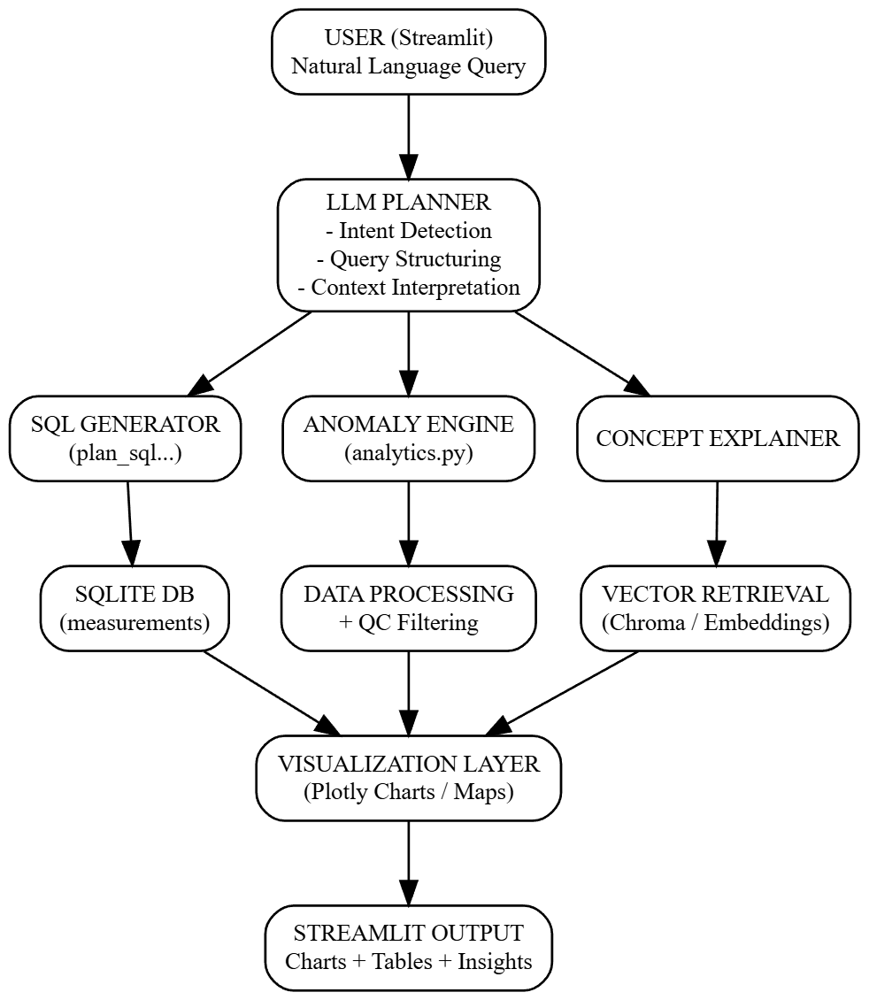

# FloatChat - AI-Powered Conversational Interface for ARGO Ocean Data

> **IIT Jammu AI/ML Hackathon - Problem Statement 1**
> An end-to-end conversational system to query, explore and visualize ARGO ocean profiling float data using natural language.

---

## Problem Statement

Oceanographic data is complex, stored in scientific formats like NetCDF, and difficult to access without domain expertise. The ARGO program generates invaluable in-situ ocean measurements (temperature, salinity, pressure) across global oceans - but extracting insights from this data requires both technical and domain skills.

**FloatChat** solves this by providing a natural language interface powered by LLMs and RAG, allowing anyone to query, visualize, and detect anomalies in ARGO data through simple conversation.

---

## Features

- **Natural Language Querying** - Ask questions in plain English; the system interprets intent and generates SQL automatically
- **Geospatial Trajectory Maps** - Visualize float paths across the Indian Ocean on interactive maps
- **Depth Profile Plots** - Explore temperature and salinity vs. pressure for individual profiles
- **Time-Series & Comparison Charts** - Trend analysis across floats, dates, and parameters
- **Anomaly Detection** - Contextual robust z-score analysis to flag suspicious readings
- **RAG (Retrieval-Augmented Generation)** - Schema and glossary context injected into LLM prompts for accurate query generation
- **Auto SQL Fix** - Failed queries are automatically retried with LLM-based error correction
- **Conversation Memory** - Planner tracks recent turns for context-aware follow-up questions
- **Read-Only Safety** - All database queries are validated and restricted to SELECT-only

---

## Architecture



---

# Project Structure

```
iit_jammu/
│
├── iit_jammu/                     
│   ├── config.py                  # Paths, API keys, model names
│   │
│   ├── app/
│   │   ├── db.py                  
│   │   ├── llm.py                 
│   │   ├── models.py              
│   │   ├── planner.py            
│   │   ├── retriever.py           
│   │   ├── visuals.py             
│   │   └── analytics.py          
│   │
│   ├── ingest/
│   │   ├── download_argo_subset.py  
│   │   ├── parse_netcdf.py          
│   │   └── load_sqlite.py           
│   │
│   ├── RAG/
│   │   └── build_vector_store.py    
│   │
│   └── data/
│       ├── raw_netcdf/            
│       ├── processed/             
│       └── sqlite/                
│
├── artifacts/
│   └── chroma/                    
│
├── streamlit_app.py               
├── requirements.txt
└── README.md
```

---

## Setup & Installation

### Prerequisites

- Python 3.10+
- A [Groq API Key](https://console.groq.com/) (free tier available)

### 1. Clone and Install

```bash
git clone <>
cd iit_jammu
pip install -r requirements.txt
```

### 2. Configure environment

Create a '.env' file in the root directory:

```env
GROQ_API_KEY=your_groq_api_key_here
```

---

## Data Ingestion Pipeline

Run these steps **once** before launching the app.

### Step 1 - Download ARGO data

Download Indian Ocean ARGO data (Jan-Feb 2024) from the ERDDAP source via 'argopy':

```bash
python -m iit_jammu.ingest.download_argo_subset
```

> You can customize the bounding box and date range in `download_argo_subset.py` by editing the `BOX` variable.

### Step 2 - Parse NetCDF to parquet

Converts raw `.nc` files into structured `measurements.parquet` and `profiles_metadata.parquet`:

```bash
python -m iit_jammu.ingest.parse_netcdf
```

### Step 3 - Load into SQLite

Loads Parquet files into a queryable SQLite database with optimized indexes:

```bash
python -m iit_jammu.ingest.load_sqlite
```

### Step 4 - Build the Vector Store

Indexes schema documentation, glossary terms, and profile metadata into ChromaDB for RAG:

```bash
python -m iit_jammu.RAG.build_vector_store
```

To force a full rebuild of an existing vector store:

```bash
python -m iit_jammu.RAG.build_vector_store --force-rebuild
```

---

## Running the App

```bash
streamlit run streamlit_app.py
```

---

## Example Prompts

| Query | What it does|
|---|---|
| `Show trajectories of floats in Jan 2024` | Renders an interactive map of float paths |
| `Plot temperature vs pressure for profile 1901910_207_20240109T233537_A` | Depth profile chart|
| `Compare salinity and temperature for float 1901910` | Side-by-side parameter comparison |
| `How many profiles are there and what is the date range?` | Dataset summary statistics |
| `What anomalies are present in temperature readings?` | Contextual anomaly detection |
| `What is QC in ARGO data?` | Domain concept explanation via RAG |

---

## Tech Stack

| Component | Technology |
|---|---|
| UI | Streamlit |
| LLM | LLaMA 3.3 70B via Groq API |
| Vector Store | ChromaDB |
| Embeddings | HuggingFace `all-MiniLM-L6-v2` |
| Database | SQLite (via SQLAlchemy) |
| Data Formats | NetCDF, Parquet, SQLite |
| Visualization | Plotly Express & Graph Objects |
| ARGO Data Access | argopy (ERDDAP) |
| Schema Validation | Pydantic v2 |

---

## Dataset

- **Source:** ARGO Global Data Repository via ERDDAP
- **Region:** Indian Ocean (60°E–90°E, 10°S–20°N)
- **Depth:** 0–500 dbar
- **Period:** January–February 2024
- **Parameters:** Temperature, Salinity, Pressure + QC flags

---


